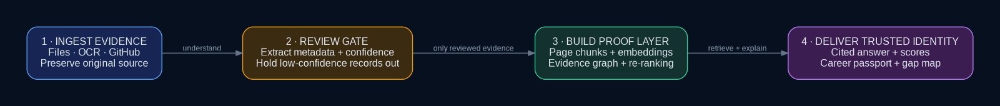

# MemoryVerse AI — Evidence-Backed Career Passport

> **Winning pitch:** MemoryVerse converts scattered certificates, projects, internship records, achievements, and GitHub repositories into a private career knowledge graph. It does not merely claim what a student knows—it shows the exact evidence, timeline, and relationships that prove how each skill was learned, demonstrated, and applied.

## Why this is not another cloud drive

Traditional storage answers **“Where is my file?”** MemoryVerse answers:

- What does this document prove?
- Which project demonstrates this skill?
- Where was the skill applied professionally?
- What evidence supports readiness for a target role?
- Which claims are self-declared, source-linked, or verified?

Every answer is grounded in original evidence and returns document/page citations.

## Hackathon-aligned modules

| Challenge requirement | Implementation |
|---|---|
| AI data ingestion | PDF, DOCX, image OCR, and public GitHub repository ingestion |
| Intelligent categorization | Grounded Gemini metadata extraction with confidence and review flags |
| Relationship engine | Explainable document progression links plus document-to-skill evidence nodes |
| Digital journey timeline | Chronological document journey with original-file access |
| Smart retrieval | Per-user semantic chunk search + Gemini re-ranking + graph expansion + cited generation |
| Original formats preserved | Private Supabase Storage paths and short-lived signed URLs |
| AI/ML techniques | NLP extraction, embeddings, Chroma vector search, Gemini re-ranking, Graph-RAG, evidence scoring |
| Evaluation | Coverage dashboard and labeled Recall@K benchmark script |

## Prize-winning differentiators

### 1. Skill Evidence Passport

Skills are not treated equally:

- **Claimed** — appears only in a resume/self-declared record
- **Certified/Learned** — supported by certification or academics
- **Demonstrated** — supported by a project
- **Applied** — supported by internship or professional evidence
- **Verified** — supported by an externally verified source
- **Repeated** — supported by multiple independent document types

The score is deterministic and explainable. It is not a job-success prediction.

### 2. Page-cited Graph-RAG

1. The question is embedded.
2. Chroma retrieves relevant page-aware chunks for the authenticated user only.
3. Gemini re-ranks the semantic candidates for direct question relevance.
4. The graph expands from the best matching documents to connected evidence.
5. Gemini receives only retrieved evidence and explainable paths.
6. The answer contains `[S1]`, `[S2]` citations, vector similarity, re-rank score, page, excerpt, and original source.

### 3. Trust-aware digital identity

- SHA-256 duplicate detection
- Self-declared vs self-uploaded vs source-linked vs verified status
- Private storage bucket
- Signed file URLs
- Supabase RLS policies
- Owner checks on every document endpoint
- Explicit, revocable share tokens
- Low-confidence integrity gate: uncertain documents are held out of vectors and graph relationships until confirmed

### 4. Source-linked GitHub evidence

Paste a public repository URL to ingest its README, languages, topics, metadata, and activity timestamp through the GitHub REST API. Repository evidence is kept distinct from uploaded claims.

## Architecture



The editable source is available in [`docs/architecture.dot`](docs/architecture.dot) and the explanation is in [`docs/architecture.md`](docs/architecture.md).

## Technology stack

**Frontend:** React 19, Vite, D3, Framer Motion, Supabase Auth  
**Backend:** FastAPI, Pydantic, Google GenAI SDK  
**AI:** `gemini-3.6-flash`, `gemini-embedding-2`  
**Retrieval:** page-aware chunks, ChromaDB cosine search, Gemini re-ranking, graph expansion  
**Persistence:** Supabase Postgres, private Supabase Storage, RLS  
**Sources:** File ingestion and GitHub REST API

Model names are environment variables so they can be changed without code edits.

## Setup without Docker

### 1. Supabase

Use **one** SQL path:

- New project: `backend/db/schema.sql`
- Existing MemoryVerse project: `backend/db/migrations/003_evidence_passport.sql`

1. Create or open the Supabase project.
2. Run the correct SQL file above. Do not use the fresh schema as an upgrade migration.
3. For legacy data, review rows with `user_id IS NULL`.
4. Enable email/password authentication.
5. Confirm the `documents` Storage bucket is private.

### 2. Backend

Windows (PowerShell):

```powershell
cd backend
py -3.11 -m venv venv
.\venv\Scripts\activate
python -m pip install -r requirements.txt
copy .env.example .env
python -m uvicorn main:app --reload --port 8000
```

macOS/Linux:

```bash
cd backend
python3.11 -m venv venv
source venv/bin/activate
python -m pip install -r requirements.txt
cp .env.example .env
python -m uvicorn main:app --reload --port 8000
```

Fill `.env` with your Gemini API key and server-side Supabase secret. Never place the backend Supabase secret in the frontend.

### 3. Frontend

Windows (PowerShell):

```powershell
cd frontend
npm install
copy .env.example .env
npm run dev
```

macOS/Linux:

```bash
cd frontend
npm install
cp .env.example .env
npm run dev
```

The included Vite configuration proxies `/api` to the backend during local development.

## Required environment variables

```env
GEMINI_API_KEY=...
GEMINI_GENERATION_MODEL=gemini-3.6-flash
GEMINI_EMBEDDING_MODEL=gemini-embedding-2
SUPABASE_URL=...
SUPABASE_KEY=...
SUPABASE_STORAGE_BUCKET=documents
ALLOWED_ORIGINS=http://localhost:5173
```

Frontend:

```env
VITE_SUPABASE_URL=...
VITE_SUPABASE_ANON_KEY=...
```

## Testing

```bash
cd backend
python -m compileall .
python -m unittest discover -s tests -v
```

Current automated tests cover:

- page numbers retained during chunking
- repeated evidence requires multiple independent sources
- resume-only evidence stays “Claimed”
- relationship engine uses progression language instead of unsupported causation
- upload extension and binary-signature validation
- valid PDF recognition
- partial ISO date normalization
- invalid date rejection
- low-confidence documents are held out of the knowledge graph
- unresolved review fields trigger the same integrity gate
- reviewed documents become graph-eligible
- re-ranker orders by direct question relevance
- re-ranker failure preserves semantic ordering and reports unavailability

### Measured quality results

The benchmark paths are exercised and their raw JSON outputs are committed under `backend/evaluation/results/`.

| Measurement | Result | Scope and disclosure |
|---|---:|---|
| OCR key-field recovery | **82% (82/100 fields)** | 20 reproducibly degraded scans generated from four visibly watermarked synthetic demo documents; not a production dataset |
| Offline retrieval Recall@5 | **1.00 (3/3 queries)** | TF-IDF cosine baseline over four synthetic demo documents; **not** a Gemini embedding claim |

**Documented failure:** on one low-contrast Python certificate fixture, OCR recovered the student, course, duration, grade, and skills but did not recover the small `DeepLearning.AI` issuer field above the 70% token threshold. The record therefore demonstrates why uncertain metadata must enter the review gate instead of silently influencing the graph.

Reproduce both results:

```bash
cd backend
python -m evaluation.generate_ocr_fixtures
python -m evaluation.run_ocr_benchmark --manifest evaluation/ocr_benchmark_manifest.json --output evaluation/results/ocr_benchmark_result.json
python -m evaluation.run_offline_retrieval_benchmark --file evaluation/sample_benchmark.json --k 5 --output evaluation/results/offline_retrieval_result.json
```

For the deployed semantic result, load the final portfolio and run:

```bash
python -m evaluation.run_benchmark \
  --user-id YOUR_SUPABASE_USER_UUID \
  --file evaluation/sample_benchmark.json \
  --k 5
```

The deployed semantic Recall@5 is intentionally not invented in this repository; it requires the final Gemini key, indexed user account, and labeled final dataset.

For a stronger final report, add anonymized owner-supplied scans using `backend/evaluation/real_scans/README.md` and publish that result separately from the reproducible synthetic fixture benchmark.

## Judge demo

1. Sign in with a clean account.
2. Upload one deliberately messy scan and show that low-confidence extraction is held out.
3. Correct its metadata so it becomes eligible for indexing.
4. Load the four visibly watermarked synthetic demo documents and import one GitHub repository.
5. Open **Career Passport** and explain claimed vs demonstrated vs applied evidence.
6. Open **Knowledge Graph** and select the Python skill node.
7. Ask: **“What evidence proves that I am prepared for a data analyst role?”**
8. Show the semantic-mode badge, similarity scores, re-rank scores, citations, and original source.
9. Show the role-gap visual and measured-quality dashboard.
10. Create, preview, and revoke a public passport link.

See [`docs/JUDGE_DEMO_SCRIPT.md`](docs/JUDGE_DEMO_SCRIPT.md) for the speaking script.

## Submission deliverables

- Working prototype: frontend + backend
- Synthetic demo fixtures: visibly watermarked and not valid credentials
- Demo video: record using the judge demo script
- GitHub repository: this clean project directory
- AI workflow/architecture diagram: `docs/architecture-diagram.png`
- Thought process sheet: `docs/THOUGHT_PROCESS_SHEET.md`
- Submission checklist: `docs/SUBMISSION_CHECKLIST.md`
- Upgrade report: `CHANGELOG_HACKATHON_UPGRADE.md`

## Honest limitations

- Uploaded files are not automatically issuer-verified. They begin as self-uploaded evidence.
- GitHub ingestion proves that a repository is publicly accessible, not that every contribution was authored by the user.
- OCR quality depends on scan quality and local OCR availability.
- Local metadata fallback is disabled by default to prevent silent loss of original-file storage; enable it only for an explicit offline demo.
- AI-extracted metadata can be wrong, so confidence and review flags are visible.
- Career recommendations are guidance based on portfolio evidence, not hiring or salary predictions.

## Official references

- Gemini models: https://ai.google.dev/gemini-api/docs/models
- Gemini embeddings: https://ai.google.dev/gemini-api/docs/embeddings
- Google GenAI SDK migration: https://ai.google.dev/gemini-api/docs/migrate
- Supabase RLS: https://supabase.com/docs/guides/database/postgres/row-level-security
- Supabase private storage: https://supabase.com/docs/guides/storage/security/access-control
- GitHub repository API: https://docs.github.com/en/rest/repos
